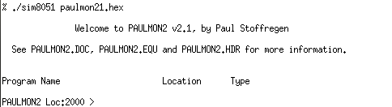

# 8051emu

## Introduction

 During college, we had to write tiny programs for a 8051-based microprocessor. The course used the Keil development tools. However, our toolchain was quite old (written for Windows 3.1, even) and so, I quickly got fed up with it.

 In the holidays, I coded this emulator, which has decent enough CPU emulation and nice debugging facilities. For example, you can run the [PaulMon2](https://www.pjrc.com/tech/8051/paulmon2.html) monitor using this emulator. Give it a try!

 Once I finished up the 8051 courses, I never really did anything else with the emulator, or 8051's in general. I hope this emulator will be useful to someone.

## License

The 8051 emulator is released using the GPL version 2 or later license.

## Screenshot

## Downloads

   * [Full source code](downloads/8051emu.tar.bz2) (36KB)
